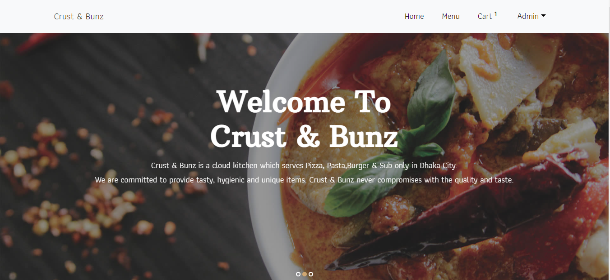
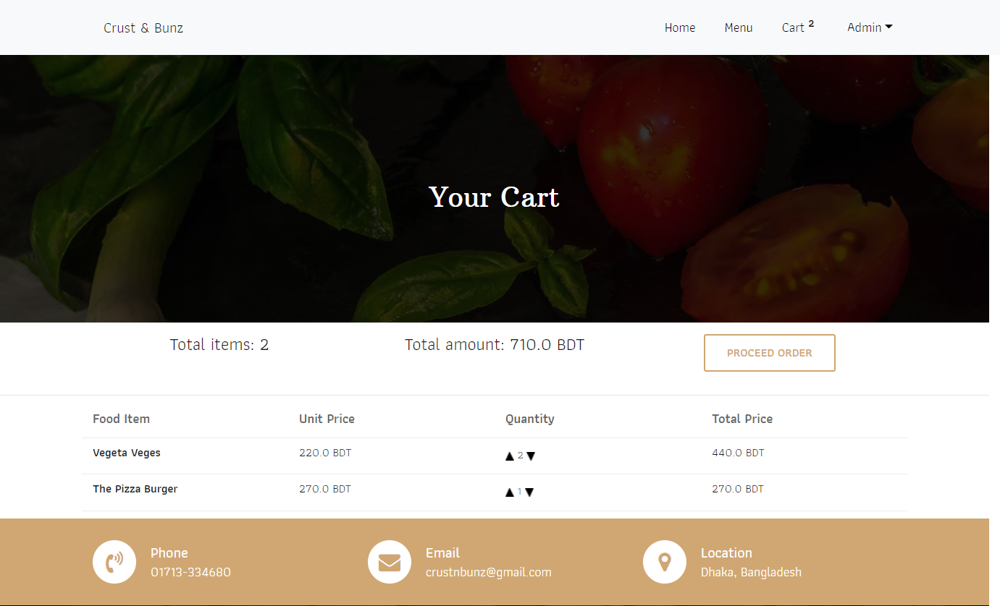
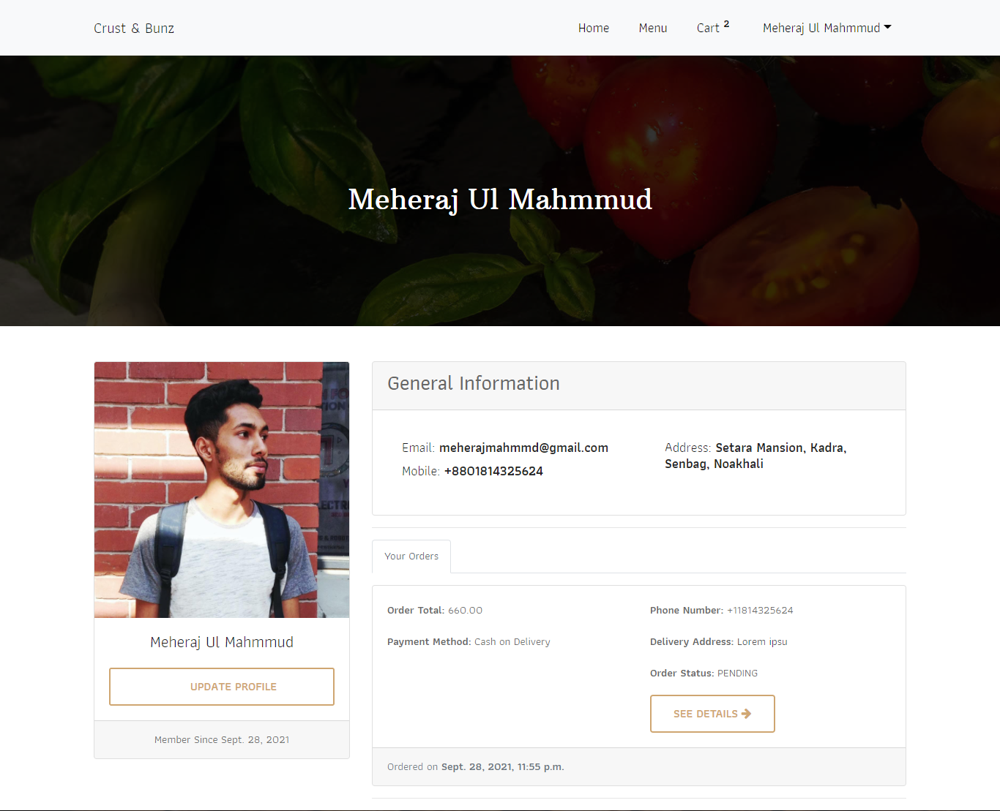
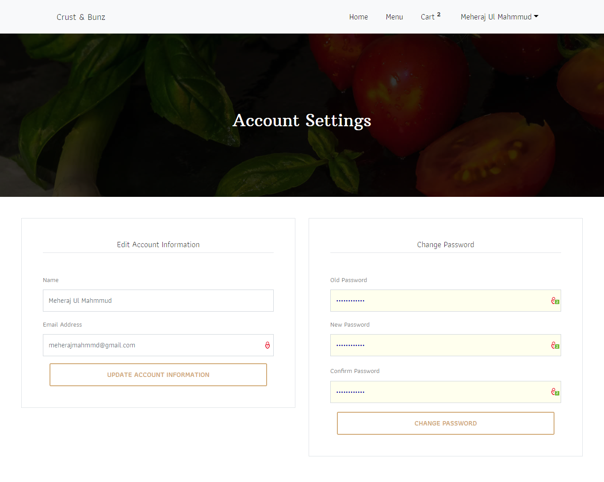
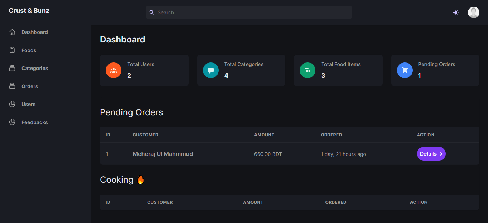
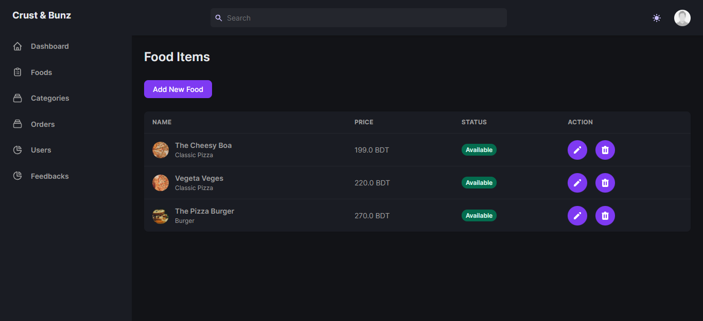
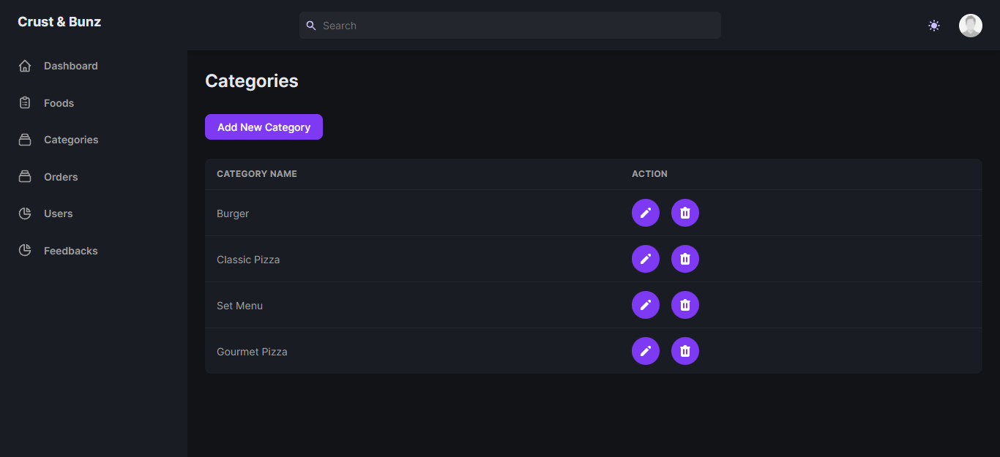
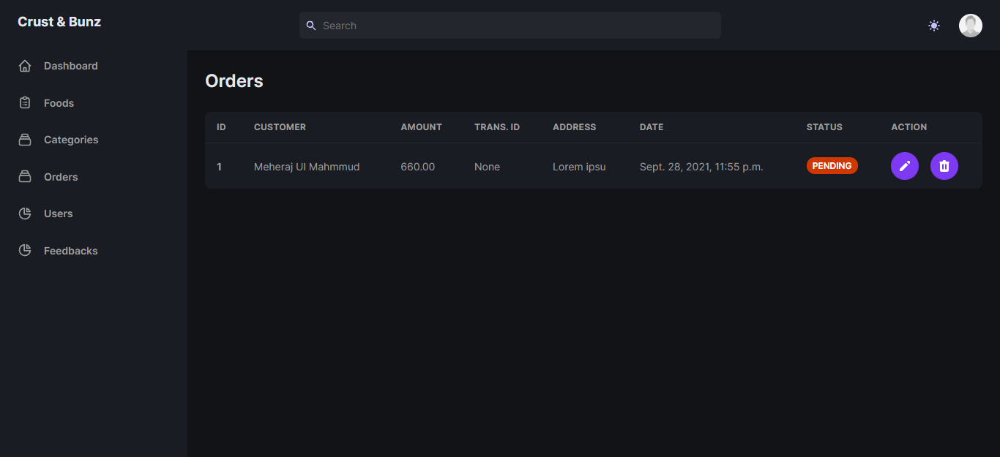
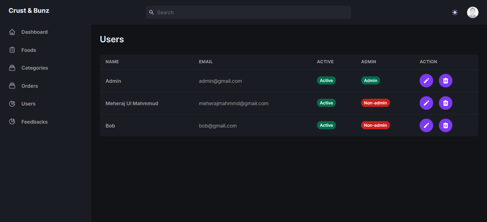
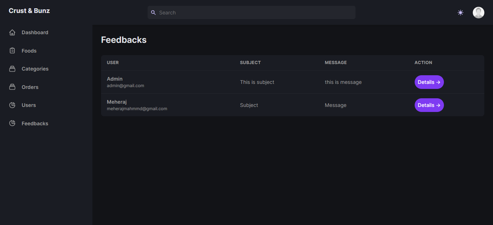

# Crust & Bunz

## How to run:
### 1. Clone project
> Make sure you have already installed python3 and git.
```
$ git clone https://github.com/MeherajUlMahmmud/Crust-and-Bunz.git
```

### 2. Create a virtual environment
```
py -m venv venv
```
### 3. Start the environment
```
venv\Scripts\activate
```
### 4. Run this command in your environment
```
pip install -r requirements.txt
```
### 5. Make Database Migrations
```
py manage.py makemigrations
```
### 6. Migrate to Database
```
py manage.py migrate
```
### 7. And start your server
```
py manage.py runserver
```

## Screenshots
### Home

### Menu

### Cart

### Profile

### Settings

### Admin Dashboard Home

### Admin Dashboard Foods

### Admin Dashboard Categories

### Admin Dashboard Orders

### Admin Dashboard Users

### Admin Dashboard Feedbacks

